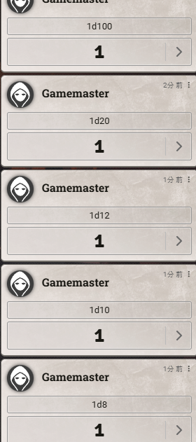
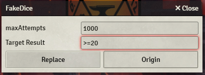
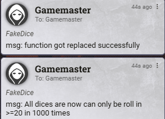
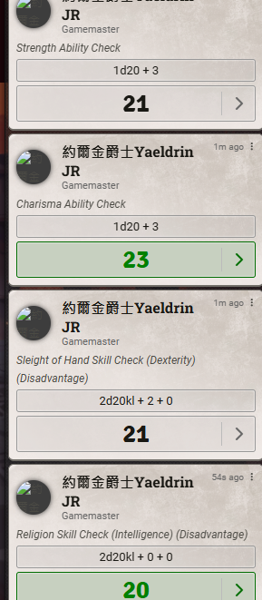
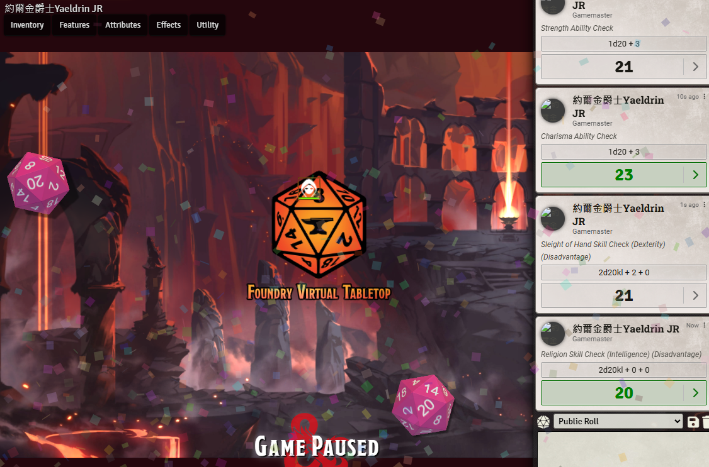

[English](README.md) | 繁體中文
# fvtt-FakeDice
假骰子(FakeDice) 是基於一個舊模組 "[Fudge](https://github.com/troygoode/fvtt-fudge)"。這個模組已經有一段時間沒有更新，且功能尚有欠缺。

所以我做了一些研究，並製作了這個模組。

假骰子(FakeDice)可以作用在任何的系統和模組上，只要系統和模組是基於原版的骰子進行更改，就能作用。

你可以簡單的學會如何使用這個模組：只要填入 ```>1``` 或 ```<=20``` 一類的內容到目標數值中。 點擊 "Replace" 按鈕，就可以將後續所有的骰子都變為你所想要的骰子。

現在起所有你的骰子都會完美的符合你填寫的目標數值。

得到滿意的結果後，點擊 "Origin" 按鈕，來讓骰子變回普通骰子。

# 注意
這個模組只適用於 GM。

這個模組並沒有修改骰面，是採用模擬的方式來修改骰子。只能出現合理數值。

# 可使用的符號
```
目標符號:
=
>
>=
<
<=
```

# 如何安裝
可以使用以下的連結，進行手動的安裝。

```https://raw.githubusercontent.com/JingShing/fvtt-FakeDice/main/module.json```

# 範例
## <=1
* 
* 
* 
## >=20
* 
* 
* 
* 
